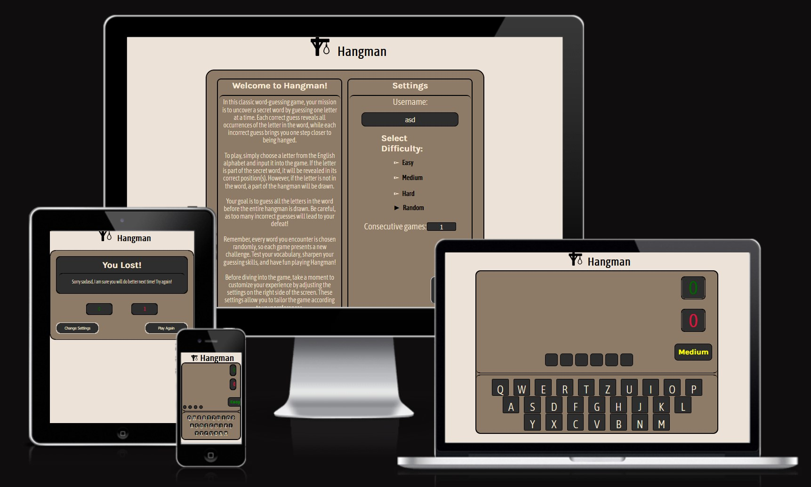
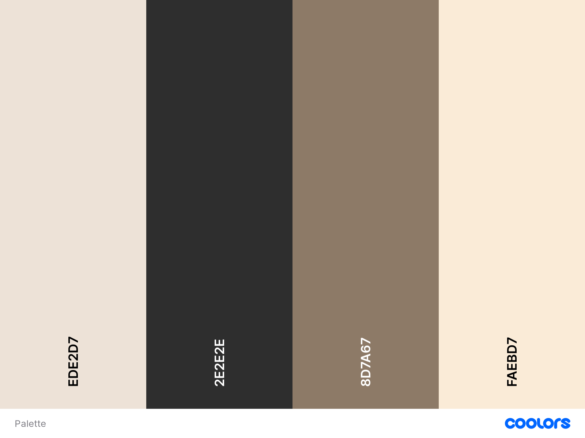

# Hangman

The Hangman Website Game is built to provide an interactive and enjoyable gaming experience for users. It offers the classic game of Hangman, where players attempt to guess a word by suggesting letters, with limited chances before the hangman is fully drawn.

## Contents

- [User Experience](#user-experience)
- [Designe](#design)
  - [Colour Scheme](#colour-scheme)
  - [Typography](#typography)
  - [Wireframes](#wireframes)
- [Features](#features)
  - [Sections](#sections)
  - [Key Features](#key-features)
- [Technologies Used](#technologies)
  - [Languages Used](#languages-used)
  - [Frameworks, Libraries & Programs Used](#frameworks-libraries--programs-used)
  - [Deployment](#deployment)
- [Testing](#testing)
  - [Validation](#w3c-validator)
    - [Initial Validation](#initial-validation)
  - [Final Validation](#final-validation)
  - [Lighthouse test](#lighthouse-test)
- [Bugs](#bugs)
  - [Known Bugs](#known-bugs)
  - [Solved bugs](#solved-bugs)
- [Credits](#credits)
  - [Content](#content)
  - [Acknowledgments](#acknowledgments)

## User Experience

### Client Goals

- Develop an engaging and entertaining Hangman game that attracts and retains players.
- Create a user-friendly interface that is visually appealing and intuitive to navigate.
- Implement challenging and varied word options to keep players engaged.
- Provide a seamless gaming experience across different devices and screen sizes.
- Enable customization options to allow players to personalize their gaming experience.

### First Time Visitor Goals

- Understand the concept and rules of the Hangman game.
- Easily navigate through the game interface and start playing quickly.
- Enjoy a visually appealing and immersive game environment.

### Returning Visitor Goals

- Have access to a variety of new and challenging words to continue enjoying the game.
- Experience a seamless and consistent gameplay experience across multiple visits

## Design

### Colour Scheme

- I have used # colour for the sites text.

- I have used # for the sites background.

- I have used # for the header and footer elements.

- I have used # for the keys on the virtual keyboard.

### Typography

Google Fonts was used for the following fonts:

[Karla](https://fonts.google.com/specimen/Karla?preview.size=41&query=karla) is used for headings on the site.

[Asap Condensed](https://fonts.google.com/specimen/Asap+Condensed?preview.size=41&query=asap)  is used for the body text on the site.

## Wireframes

Wireframes were created desktop using figma.

[Welcome Section Wireframe](./docs/screenshots/welcome_section.jpg) 

[Game Section Wireframe](./docs/screenshots/game_section.jpg)

[Post Game Section](./docs/screenshots/postgame_section.jpg)

## Features

The website comprises three sections, which appear and disappear as required.

### Sections

- Welcome / Settings section
  - This is the first section that appears when user enter the site.
  - In this section, the user is greeted with a welcome message and introduced to the rules of the game and instructions on how to play.
  - In the addition to the instructions, user has an option to change settings to fit his/hers play style.
- Game section

  - Section that appears after the Welcome section
  - Here, the user can interact with the site in various different ways to play a game of Hangman.

- Post game section
  - This section appears after the user has completed the game.
  - Here, the user sees his/hers final score and is able to choose between two options : play again or change settings.

### Key Features

- User-friendly Interface

  - The game provides a visually appealing and intuitive user interface, allowing players to easily interact with the game and make their letter guesses.

- Word Database

  - The repository includes a comprehensive word database that stores a wide range of words for the game. This ensures that players are presented with diverse and engaging challenges during gameplay.

- Game Logic

  - The repository implements the core game logic, including the generation of a random word from the database, tracking the guessed letters, and managing the number of remaining attempts. It enforces the rules of the game and provides feedback to the players based on their guesses.

- Visual Feedback

  - The game offers visual feedback to the players as they make their guesses. It displays the hangman's progress, updating the drawing based on the number of incorrect guesses. It also highlights the correctly guessed letters within the word.

- Win/Loss Conditions

  - The repository includes mechanisms to determine the win or loss conditions for the game. It detects when the player has successfully guessed all the letters in the word or when they have exhausted their attempts, resulting in a win or loss outcome respectively.

- Score Tracking

  - The game tracks the player's score, keeping a record of their wins and losses.

- Customization Options

  - The repository includes options for customization, such as difficulty levels, timer option and number of games they would like to play in a row. This allows players to personalize their gaming experience and challenge themselves accordingly.

- Responsive Design
  - The Hangman repository is designed to be responsive, ensuring compatibility and optimal user experience across various devices and screen sizes.

## Technologies

### Languages Used

Html, Css and JavaScript were used to create the Hangman Website Game.

### Frameworks, Libraries & Programs Used

[Readme.so](https://readme.so/editor) - Help with creating README.md and TESTING.md

[Figma](https://www.figma.com) - Used to create wireframes.

Git - For version control.

[Github](https://github.com/) - To save and store the files for the website.

[Google Fonts](https://fonts.google.com/?preview.size=41) - To import the fonts used on the website.

[Symbl](https://symbl.cc/en/) - For the iconography on the website.

Google Dev Tools - To troubleshoot and test features, solve issues with responsiveness and styling.

[Am I Responsive?](https://ui.dev/amiresponsive) - To show the website image on a range of devices.

Prettier extension for VS-Code - To format the code

No libraries were used and all the code was written by me.

### Websites used for research purposes to help with the project

[W3schools](https://www.w3schools.com/)
[CssTricks](https://css-tricks.com/)
[MDN Web Docs](https://developer.mozilla.org/en-US/)

## Deployment

Github Pages was used to deploy the live website.

## Testing

A detailed description of testing all of the features can be found in [TESTING.md](./TESTING.md) file

### W3C validator

The W3C validator was used to validate the HTML and CSS files for the project.

#### W3C Validation

[HTML Validation](./docs/screenshots/html_validation.png)
[CSS Validation](./docs/screenshots/css_validation.png)

#### JS Hint

JsHint was used to validate JavaScript file.

[JavaScript Validation](./docs/screenshots/javascript_validation.png)

### Lighthouse test

[Lighthouse Test](./docs/screenshots/lighthouse.jpeg)

## Bugs

### Known Bugs

Late respones:
  * Win and Lose counter don't increment right away it takes one additional click on any of the letter buttons for counters to update, same is with the end of the game loop. To display the post game section one additional click is required.
Infinite number input:
  * In the number input field, it is possible to put infinite amount of games. It is not capped.
Wrong guess not updating properly
  * Update pyramid function is one step to late  

## Credits

### Content

Content and code for this project were written by Robert Zeba.

### Acknowledgments

I would like to acknowledge the following people/technologies that helped me along the way in completing this project:

- My family & friends for their feedback on the project.
- My Code Institute Mentor Graeme Taylor
- ChatGPT which I used to generate random words for the game.
  - [Chat link](https://chat.openai.com/share/beb11ce4-b8e7-4c5e-b5b1-b15300c717d3)
